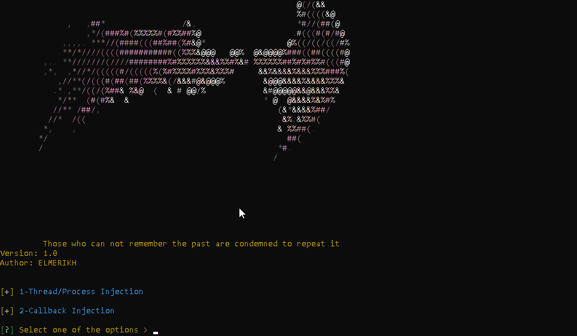

Greetings
-----------------

SephirosGo  Shellcode Loader , that let s you choose how to load your shellcode filellessly or just embeding it using different injection techniques

avaiable techniques :

callback :
            [1] createTimerQueue.go
            [2] enumDesktop.go
            [3] enumFonts.go
            [4] gray.go

Process/thread injection :
            [1] CreateProcess.go
            [2] createthread.go
            [3] earlybird.go
            [4] NtQueueApcThreadEx-Local.go
            [5] RtlCreteUserThread.go
            [6] Syscall.go
            [7] Uuid.go

requirements
-----------
go 

python 3

setup
----------
git clone https://github.com/ELMERIKH/SephirosGo

cd SephirosGo

python -r install requirements.txt

go install mvdan.cc/garble@latest

export PATH=$PATH:~/go/bin (if on linux)

python3 sephirosGo.py

To do 
----------

add encoding and ecryption for shellcode

⚠️ DISCLAIMER :
----------------------
ME The author takes NO responsibility and/or liability for how you choose to use any of the tools/source code/any files provided. ME The author and anyone affiliated with will not be liable for any losses and/or damages in connection with use of SephirosGo. By using SephirosGo or any files included, you understand that you are AGREEING TO USE AT YOUR OWN RISK. Once again SephirosGo is for EDUCATION and/or RESEARCH purposes ONLY